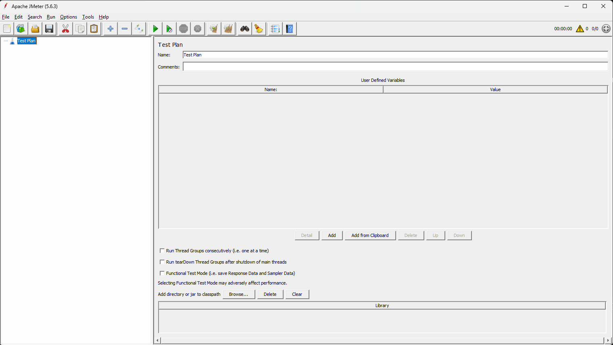
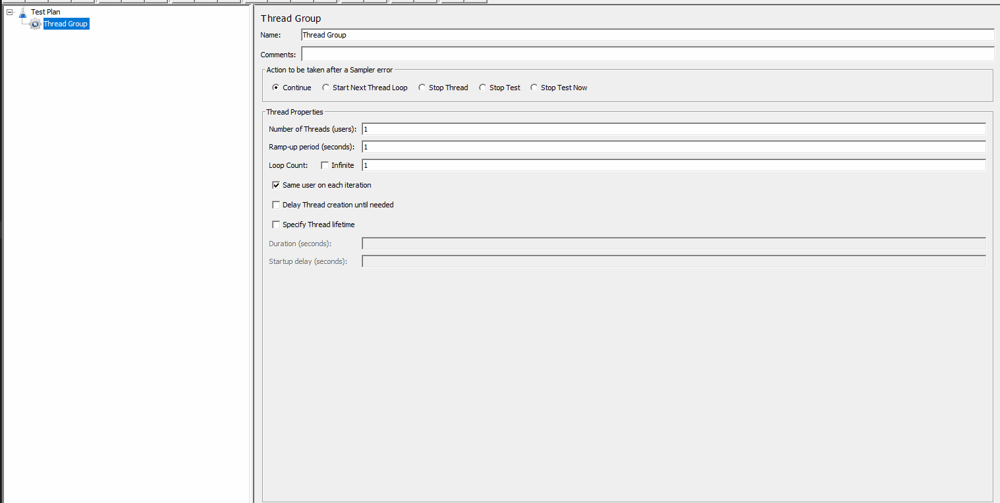
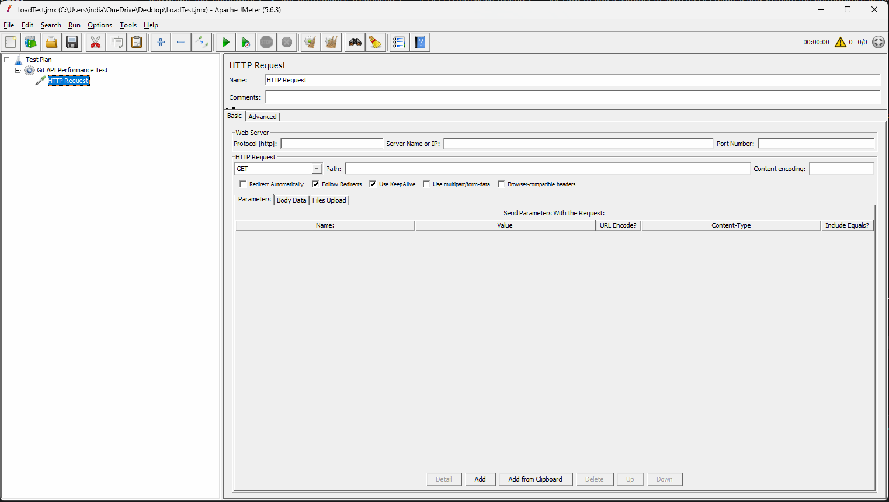
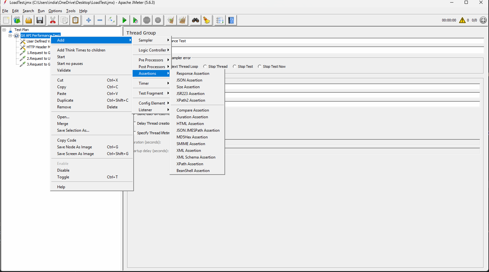

# API Performance Testing

## What is performance testing? 
What happens when many users use my application at the same time? 

How fast is the application loading? 
How stable it is when multiple users are using my application? 
Whether our application is scalable? Is it possible to increase the bandwidth and add a few more users? 

## Different types of performance testing ?

1. Load testing : Load testing is all about testing the system under expected user load by gradually increasing the load. 
For an example, the capacity of our application is 100 users, so we are going to start from 10 users and gradually increase to 1,000, and we are going to analyze the application behavior. 
Main goal of load testing is checking the response time and stability of our application. 

2. Stress testing : Trying to push our system beyond the limits 
For an example, the capacity of our application is 100 users, so we are going to add 10% or 20% more users on our application and verify the application behavior. 
Main goal of stress testing is identifying the breaking point. 

3. Spike testing : Sudden increase or decrease in the load within specific intervals. 
Best example to understand this is a flash sale happening on Amazon. 
Main goal is just to understand the system reaction to the sudden spikes 

4. Endurance testing or SOAK testing : endurance testing is all about running the system for a long duration, continuously. 
Main goal is understanding the memory leakages and degradation of our application performance when we are going to maintain the same load for long hours. 

## Why is performance testing so important? 
Performance testing is very important because even if your application is functionally correct, if it is slow or if it is facing application crashes, your users are going to leave your application. 

Especially, performance testing is very important because if your application is working so fast, all your users are so happy. 
But your application is slow. Immediately, people are going to uninstall your app. 

## What are all the different tools available in the market to do performance testing? 
1. Apache JMeter (Open Source)
2. Gatling (open source)
3. K6  (open source)
4. Locust (open source)
5. Load runner (enterprise version)
6. BlazeMeter  (enterprise version)
7. Neo loade, Web Load (enterprise)

## What is JMeter? 
Apache JMeter is an open-source performance testing tool. This tool will be used to 
simulate users 
sending requests (HTTP, DB, UI)
verify the performance metrics. 

Mainly, this JMeter tool can be used to perform:
- Web application performance testing
- API performance testing
- Database performance testing
- Load and stress testing especially

## How to use JMeter tool to perform API performance testing? 

1. Download the JMeter zip file from the link. "https://dlcdn.apache.org//jmeter/binaries/apache-jmeter-5.6.3.zip"
2. Extract the files from the JMeter zip. 
3. Navigate to the folder 'bin' and, inside the 'bin' folder, double-click on the "ApacheJMeter.jar". 
(We need to install JDK to run Jmeter, https://www.oracle.com/in/java/technologies/downloads/#java25)
4. Wait until test plan template is getting displayed to begin the performance testing by using JMeter.

## What is a test plan in JMeter? 
Test plan is a root container that defines what to test, how to test, and with how many users you want to test your application. 
Within this test plan, now we can add:
- thread group 
- samplers
- listeners
- configuration elements, etc.

## What is Thread Group? Different options need to be updated within the Thread Group Template ?
Adding the Thread Group is the starting step of performance testing by using JMeter. 
Test Group in JMeter represents a group of virtual users (threads) that can execute your test cases. 

Adding Thread group inside the test plan :

Right click on test plan => Add => Threads(users)  => Thread Group

Different components of Thread Group :

1. Name : name of your project or the purpose of doing your performance test 
Ex: Login Load Test, API Performance Test etc..

2. Comments : short description of your performance testing and related scenarios 
Ex: testing login API with 100 concurrent users 

3. Action to be taken after a sampler error : what should happen when your request fails in middle? 
Continue (default) : ignore the error and continue the execution. 
Start next thread loop : stop current iteration and start the next loop
Stop Thread: Stop the entire thread for the current user
Stop Test : stop the entire test. 

4. Thread Properties (Most Important part to be updated)
=> Number of Threads or Users : totally, how many virtual users do we want to create? 
Ex: create 100 users. 

=> Ramp up period in seconds : total time that you want to set to deploy all the users 
Ex: 10 seconds. 
If we need to add 100 users to test our application within 10 seconds, that means every one second we need to add 10 additional users. 
users per second = 100/10 = 10 users

=> Loop count : total number of times this process should continue 
Ex: 5 => I want to repeat the entire process with 100 users, five times. 
infinite => Run continuously until I stop. 

5. Same user on each Iteration : same session or user re-used with same configuration. 
6. Delay thread creation until needed : during the execution process, don't create virtual users until we need a trigger to execute. 
7. Specify thread lifetime : 
=> Duration : duration is all about the total time that you want to test the run. (Ex: 60 -> Test run for one minute only.)
=> Startup Delay : Delay before each test begins (ex: 10 -> test start after 10 seconds.)

## What is a sampler in JMeter? 
In simple terms, a sampler is an actual API call or some request executed by a virtual user. 

There are multiple types of samplers available in the JMeter tool. 
- HTTP request (mostly used for APIs)
- JDBC request for database testing
- FTP request

## How to add a sampler to send an API request and validate the performance of the API request? 
Right click on the Thread group => HTTP request template will be displayed ==> We should update API request details within the HTTP request template

## What is the config elements in JMeter? 
Right click on the Thread group => Config Element ==> Select Component
Config elements are nothing but a set of templates that we are going to use to maintain the test data to provide or pass header values to our API requests. 

Ex: 
User Defined Variables > To maintain the test data that we can reuse in each and every API request 
Http Header Manager > The component that we are going to use to pass header values to each and every API request 

## Assertions in JMeter ?
In simple terms, assertion is all about the JMeter method that is going to verify whether the response is correct or not. 

Why are assertions important? 
- It is going to ensure the correctness of each request
- It can catch the failures. 
- It can validate response data. 

Different types of assertions available in JMeter 

Response Assertion 
JSON Assertion 
Size Assertion 

## Listeners in JMeter 
Listeners are the components in JMeter that can record the test results of your performance testing. 

Ex:
- View results tree ==> This listener can capture the entire request along with the response for each and every individual request. 
- Summary Report ==> This listener can capture the response time of each and every request and also the average, minimum and maximum response time for each and every request. 
- Assertion results ==> This listener can capture the results of each and every assertion. 

## Logical Controller in JMeter ?
Logical controller can control how to run requests and when to run requests. 
Different types of logical controller if you see,
- if controller => Execute request only if condition is true. 
- Loop Controller => How many times do we want to run the request? 

## Pre-processor and post-processor 
Pre-processor is a component that is going to execute before a sampler request is sent. 

Ex: JSR223 PreProcessor
long timestamp = System.currentTimeMillis();
vars.put("currentTime",timestamp.toString());

Post Processor is a component that is going to execute after receiving response.
{
    "token": "1234abcd"
}

